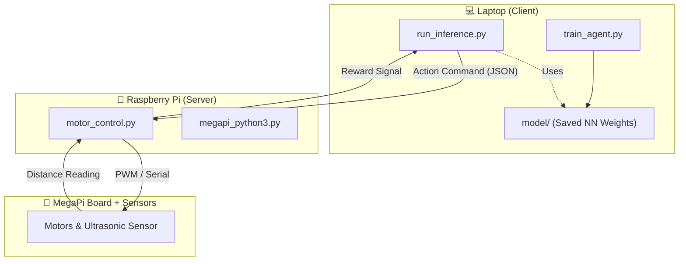

# Project-Juggernaut

This project demonstrates a Reinforcement Learning (RL) approach for obstacle avoidance using a MegaPi-based robot.

## Solution Architecture



## RL Feedback Cycle

[Robot Action] → [Environment Response] → [Reward Calculation] → [Model Update]

        ↑------------------------------------------------------------↓

## Quick Start

Follow these steps to get started with the client-server setup.

### 1. Prerequisites
- A Makeblock MegaPi or equivalent microcontroller board connected to motors and ultrasonic distance sensor.
- A laptop (client) and Raspberry Pi (server) connected to the **same network**.
- Python 3.8+ with Conda or venv available.

### 2. Set Up the Server (Raspberry Pi)
```bash
cd server
pip install -r requirements.txt
# or using conda:
conda env create -f environment.yml
python motor_control.py
```

### 3. Set Up the Client (Laptop)
```bash
cd client
conda env create -f environment.yml
conda activate rl_robot
```

### 4. Train the RL Agent
```bash
python train_agent.py
```

### 5. Run Inference
```bash
python run_inference.py
```

For more details or questions please contact - nikit.sharma.au@member.mensa.org
